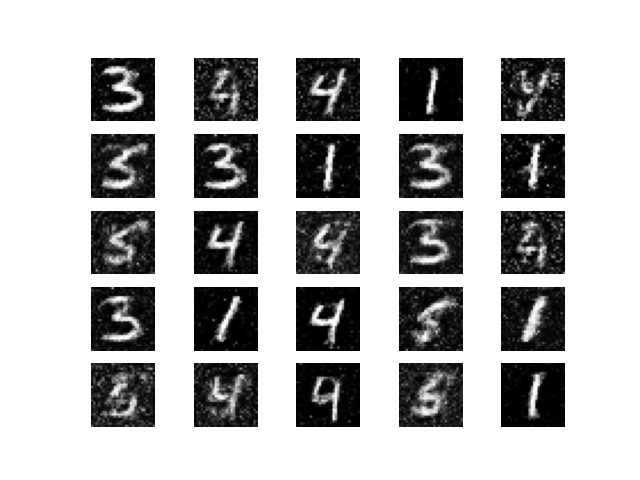
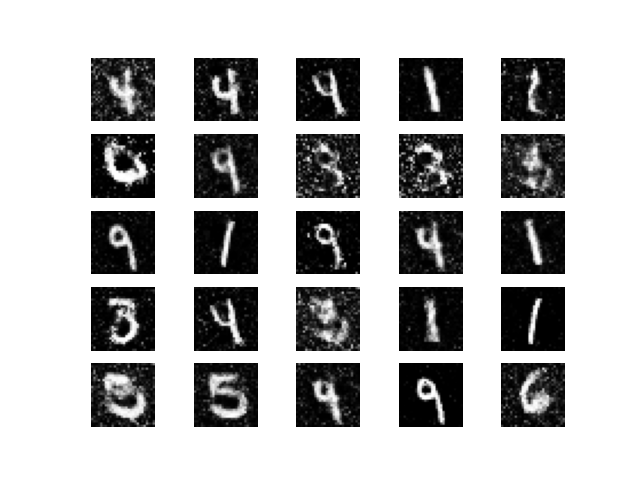
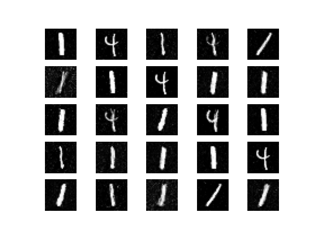
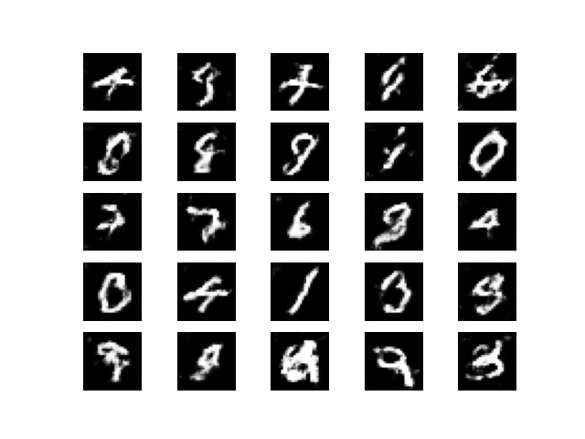
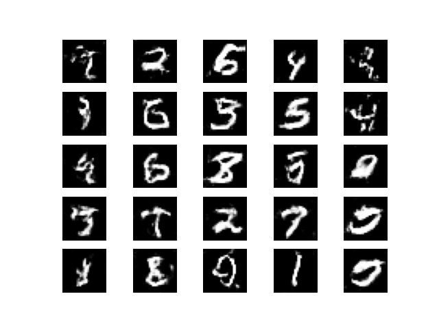
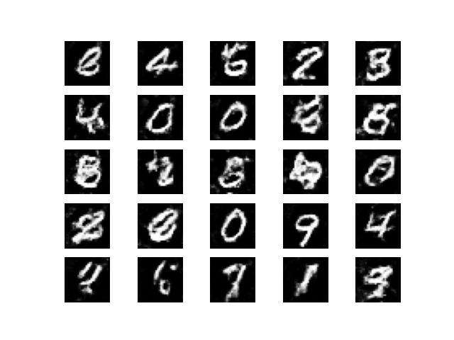

# Generative Adversarial Networks Bundle

Generative Adversarial Networks are a pair of models which behave as adversaries to each other in order to competeand learn from experience to generate artificial data. This data could be anything; audio, text, images, numerical data.

This module implements GANs using the [Generalized Neural Network bundle](https://github.com/hpcc-systems/GNN). It can be used in various ways according to how the input is given and the output desired. Typically, the program flow goes as follows: -
1) Read the dataset and convert into appropriate tensor using GNN.Tensor functions.
2) Define the Generator and Discriminator model obeying the rules of GNN interface.
3) Call GAN.train() with the parameters defined below to train the GANs for set number of Epochs and given batchSize
4) Use returned generator to predict using GNN functions and returned discriminator to distinguish fake and real data
5) Output the predicted values as required for understanding

Refer to Test/simpleGANtest.ecl for a better understanding of the working. 

## How to use

Assuming that HPCC cluster is up and running in your computer: -
1) Install ML Core as an ECL bundle by running the below in your terminal or command prompt.

        ecl bundle install https://github.com/hpcc-systems/ML_Core.git

2) Make sure that Python3 and Tensorflow is installed on each server running HPCC systems platform software. You may install tensorflow by running the below.

        pip install tensorflow

3) Install Generalised Neural Networks bundle by running the below in your terminal or command prompt.
        
        ecl bundle install https://github.com/hpcc-systems/GNN.git

4) Now that the dependencies have been taken care of, install the current bundle by cloning this repository and running the below command

        ecl bundle install GAN

5) Until further updates to GNN for a certain weights issue, it is advised to run the model on the hthor cluster. It works well in hthor, but in thor, there are a few issue that are needed to be resolved. You run it by executing the following command if HPCC systems platform is running on server: -

        ecl run hthor <filename>

This should enable you to use the GAN train function given the dataset

## Helpful Test files

1. **simpleGANtest.ecl**

    This test file tries to generate MNIST dataset using mostly Dense layers. This is the most primitive kind of GAN and it shows that the GAN works. The main working file is this. 
    End of this file also has a statement which enables you to run predict as many times as required separately, without requiring you to run the whole program again. 

2. **predictGenTest.ecl**

    This test file is used to predict the saved generator model with different noise types as many times as required. simpleGANtest.ecl and DCGANtest.ecl save their models in a logical file to be able to use for predictions after. 

3. **DCGANtest.ecl**

    This test file is the exact same as simpleGANtest.ecl, but has different layers. They are mostly convolutional neural networks and provide a better output than simple GAN. This shows that the only difference for GANs is the layers and the train function need not be changed at all for different kinds of GANs.

4. **saveGenTest.ecl**

    This test file is a sort of reference for how models are being saved. For any further type of GAN developed, saveTest.ecl may be referred to see how the model is saved easily. 

## Design

For the implementation of GANs, weight transfer between neural network models is used so that the models stay connected and are able to train adversarially. This is achieved in Python or JavaScript using objects, but in ECL, weights were transferred between models to train successfully.

## Outputs of various models tested

More models will be trained and outputs will be uploaded over time

### Simple GAN output

#### Epoch 2000

#### Epoch 3000

#### Epoch 4000

### Deep Convolution GAN output

#### Epoch 2000

#### Epoch 3000

#### Epoch 4000

